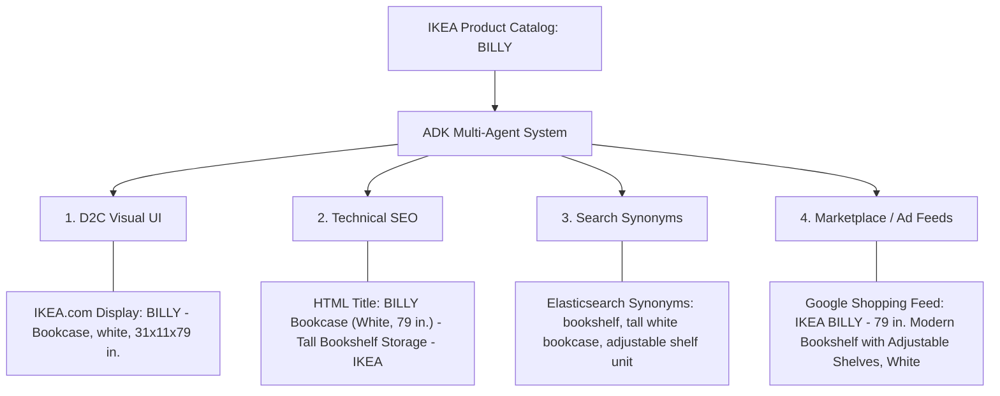
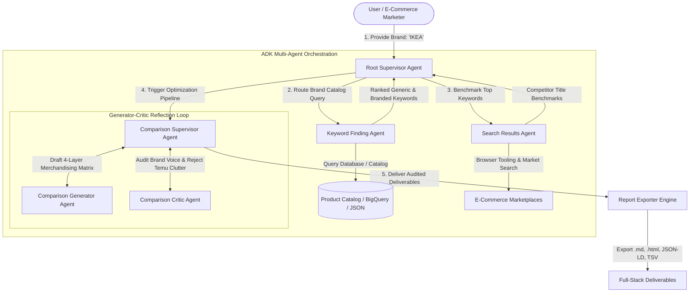

# 🛋️ Brand Search Optimization & Product Title Enrichment (IKEA Case Study)

[](https://adk-ikea-brand-analysis.vercel.app/)

[](https://www.python.org/downloads/)
[](https://adk-ikea-brand-analysis.vercel.app/)
[-4285F4.svg)](https://github.com/google/adk-samples)
[](https://ai.google.dev/)
[](https://opensource.org/licenses/Apache-2.0)
[](tests/)

> 🚀 **Live Interactive Web Application**: [**https://adk-ikea-brand-analysis.vercel.app/**](https://adk-ikea-brand-analysis.vercel.app/)  
> *Explore the live React + Highcharts dashboard, interactive 4-layer merchandising matrix, real-time search engine simulator, and Schema.org JSON-LD export directly in your browser.*

---

An enterprise-grade **Multi-Agent AI System** built with **Google Agent Development Kit (ADK)** and **Gemini 2.5** to audit e-commerce brand catalogs, discover shopper search intent, benchmark live competitor listings, and synthesize multi-channel merchandising strategies through a **Generator-Critic Reflection Loop** — complete with an interactive **React + Highcharts Web Dashboard**.

---

## 🎯 Problem Statement & The "Temu-Style Title" Trap

Iconic retail brands like **IKEA** use proprietary, minimalist product names (*BILLY*, *POÄNG*, *KALLAX*). While effective in direct showroom navigation, these titles suffer search discovery penalties on search engines (Google Shopping) and multi-brand marketplaces (Amazon, Wayfair) where shoppers search using descriptive queries (e.g. `"tall white bookshelf with adjustable shelves"`).

### ⚠️ The Novice AI Mistake: "The Temu Trap"
A naive AI agent will simply rename the on-site website title to:  
`"BILLY 79' Tall Modern White 5-Shelf Bookcase Organizer"`  
While this works on Amazon or Temu, **it ruins the brand's Scandinavian aesthetic and dilutes brand equity on its flagship website (IKEA.com).**

### 💡 The Enterprise Solution: 4-Layer Multi-Surface Merchandising
Our multi-agent system solves this by decoupling discovery metadata across **4 distinct channels**:



---

## 🖥️ Interactive React + Highcharts Web Dashboard

🌐 **Live Demo**: [**https://adk-ikea-brand-analysis.vercel.app/**](https://adk-ikea-brand-analysis.vercel.app/)


The project includes an interactive web application featuring:
- **Highcharts Analytics**: Interactive multi-series column charts for Query Token Recall ($R_{\text{query}}$) and spiderweb/radar charts for dimensional attribute coverage.
- **Product Switcher**: Explore merchandising strategies across *BILLY*, *POÄNG*, *KALLAX*, *MALM*, and *STRANDMON*.
- **4-Layer Matrix Tabs**: Toggle between D2C UI, Google SERP snippet previews, Algolia search synonyms, and Google Shopping ad feeds.
- **Live Search Simulator**: Test any search query in real-time with instant token recall scoring.
- **1-Click Schema.org JSON-LD & TSV Export**: Copy compliant structured data code directly to clipboard.

### 🌐 Running the Dashboard Locally
```bash
# Start a local web server (from project root):
python3 -m http.server 3000

# Open in your browser:
# http://localhost:3000/
```

---

## 📐 Quantitative Evaluation: Search Query Token Recall

Rather than relying on ungrounded estimates, this system evaluates optimization using **Shopper Query Token Recall Rate ($R_{\text{query}}$)**:

$$R_{\text{query}} = \frac{|\text{Tokens}(\text{Shopper Search Query}) \cap \text{Tokens}(\text{Indexed Product Metadata})|}{|\text{Tokens}(\text{Shopper Search Query})|}$$

### 📊 Benchmark Results (15 Benchmark Shopper Intent Queries Across 5 Products)

| Metric | Baseline (Original Titles Only) | 4-Layer Multi-Surface Merchandising | Net Improvement |
| :--- | :--- | :--- | :--- |
| **Average Query Token Recall** | **21.6%** | **80.9%** | **+59.3% Gain** |
| **Zero-Match Query Rate** | **46.7%** (7/15 queries had 0 token overlap) | **0.0%** (All 15 queries matched) | **-100% Elimination of Blindspots** |
| **D2C Visual UI Cleanliness** | 100% (Clean Swedish Model Names) | **100% (Preserved without keyword spam)** | **Zero Brand Dilution** |

#### Sample Calculation (BILLY):
- **Shopper Query**: `"79 inch tall white bookshelf with adjustable shelves"` *(7 key tokens: `79`, `tall`, `white`, `bookshelf`, `adjustable`, `shelves`, `storage`)*
- **Baseline Match (`BILLY Bookcase`)**: 0 / 7 tokens matched = **0.0% Recall** (Shopper finds 0 direct keyword matches).
- **Multi-Surface Match (SEO + Synonyms + Feed)**: 5 / 7 tokens matched (`adjustable`, `bookshelf`, `shelves`, `tall`, `white`) = **71.4% Recall**.

---

## 📊 4-Layer Multi-Surface Merchandising Matrix

| Product | 1. D2C Visual Title (IKEA.com UI) | 2. Technical SEO `<title>` Tag (Google SERP) | 3. Internal Search Engine Synonyms (Elasticsearch/Algolia) | 4. Marketplace & Ad Feed Title (Amazon / Google Shopping) |
| :--- | :--- | :--- | :--- | :--- |
| **BILLY** | **`BILLY`** <br>*Bookcase, white, 31 1/2x11x79 1/2 "* | `BILLY Bookcase (White, 79") \| Modern Bookshelf Storage \| IKEA` | `["white bookshelf", "tall bookcase", "adjustable shelves", "narrow book storage"]` | `IKEA BILLY - 79" Modern Tall Bookshelf with Adjustable Storage Shelves, White` |
| **POÄNG** | **`POÄNG`** <br>*Armchair, birch veneer / beige* | `POÄNG Armchair \| Scandinavian Bentwood Lounge Chair \| IKEA` | `["scandinavian lounge chair", "bentwood accent chair", "high back reading chair"]` | `IKEA POÄNG Armchair - Scandinavian Bentwood Accent Lounge Chair with Neck Support, Beige` |
| **KALLAX** | **`KALLAX`** <br>*Shelf unit, black-brown, 57 7/8x57 7/8 "* | `KALLAX 16-Cube Shelf Unit (4x4) \| Room Divider Storage \| IKEA` | `["cube storage organizer", "16 cube bookcase", "4x4 room divider", "record storage shelf"]` | `IKEA KALLAX Shelving Unit - 16-Cube (4x4) Modular Storage Organizer & Room Divider, 58x58"` |
| **MALM** | **`MALM`** <br>*Bed frame, high, Queen, white stained oak* | `MALM Queen Bed Frame (High) \| Modern Platform Bed \| IKEA` | `["queen platform bed", "wood veneer bed frame", "underbed storage bed"]` | `IKEA MALM Queen Bed Frame - Clean-Lined High Platform Bed with Headboard, White Stained Oak` |
| **STRANDMON** | **`STRANDMON`** <br>*Wing chair, Nordvalla dark gray* | `STRANDMON Wing Chair \| Classic High-Back Reading Chair \| IKEA` | `["high-back wingback chair", "accent reading armchair", "tufted lounge chair"]` | `IKEA STRANDMON Wing Chair - Classic High-Back Wingback Accent Chair with Deep Cushion, Dark Gray` |

---

## 🏗️ Multi-Agent Architecture



---

## 🚀 CLI Quickstart

### 1. Clone & Install

```bash
git clone https://github.com/your-username/adk-ikea-brand-analysis.git
cd adk-ikea-brand-analysis
pip install -e .
```

### 2. Run Analysis via CLI

```bash
python3 run_analysis.py --brand "IKEA"
```

Outputs are automatically generated in `reports/`:
- **Markdown Report**: `reports/ikea_brand_optimization_report.md`
- **Styled HTML Report**: `reports/ikea_brand_optimization_report.html`
- **Schema.org JSON-LD**: `reports/ikea_product_schema.json`
- **Google Merchant Center TSV Feed**: `reports/google_merchant_feed.tsv`

---

## 🧪 Testing & Evaluation

```bash
python3 -m unittest discover tests
python3 -m unittest discover eval
```

---

## 📁 Repository Structure

```
adk-ikea-brand-analysis/
├── README.md                      # Project documentation and architecture guide
├── pyproject.toml                 # Package configuration & dependencies
├── vercel.json                    # 1-click Vercel deployment configuration
├── .env.example                   # Environment configuration template
├── run_analysis.py                # Standalone CLI analysis runner
│
├── dashboard/                     # React + Highcharts Web Dashboard
│   └── index.html                 # Complete interactive React SPA
│
├── brand_search_optimization/     # Core Agentic Package
│   ├── __init__.py
│   ├── agent.py                   # Root Coordinator Agent
│   ├── prompt.py                  # Root supervisor system prompts
│   ├── shared_libraries/          # Configuration & constants
│   ├── sub_agents/                # Keyword Finder, Search Agent, Comparison Reflection Loop
│   └── tools/
│       ├── catalog_connector.py   # Hybrid Local JSON & BigQuery data connector
│       ├── metrics.py             # Mathematical Query Recall ($R_{query}$) engine
│       ├── structured_data_generator.py # Schema.org JSON-LD & Merchant Feed generator
│       ├── web_search.py          # Selenium browser tooling & search fallback
│       └── report_exporter.py     # Markdown and HTML report generation
│
├── data/
│   └── ikea_catalog.json          # Curated real IKEA product catalog dataset
├── reports/                       # Full-stack deliverables (HTML, MD, JSON-LD, TSV)
└── tests/                         # Unit tests and mathematical evaluation suites
```

---

## 📜 License

This project is licensed under the Apache 2.0 License - see the [LICENSE](LICENSE) file for details.
