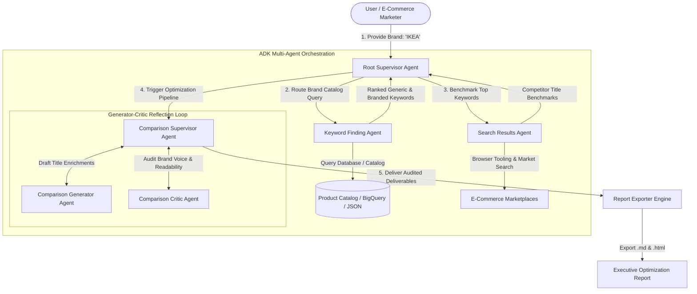

# 🛋️ Brand Search Optimization & Product Title Enrichment (IKEA Case Study)

[](https://www.python.org/downloads/)
[-4285F4.svg)](https://github.com/google/adk-samples)
[](https://ai.google.dev/)
[](https://opensource.org/licenses/Apache-2.0)
[](tests/)

An enterprise-grade **Multi-Agent AI System** built with **Google Agent Development Kit (ADK)** and **Gemini 2.5** to audit e-commerce brand catalogs, discover shopper search intent, benchmark live competitor listings, and synthesize optimized product titles through a **Generator-Critic Reflection Loop**.

---

## 🎯 Problem Statement & Business Context

Iconic retail brands like **IKEA** use proprietary, minimalist product names (e.g., *BILLY*, *POÄNG*, *KALLAX*). While effective in direct brand navigation, these titles suffer significant search discovery penalties on search engines (Google Shopping) and multi-brand marketplaces (Amazon, Wayfair):

1. **Zero-Result & Low-Ranking Searches**: Shoppers search using descriptive, functional queries (e.g., `"tall white bookshelf with adjustable shelves"` or `"16-cube room divider storage"`) rather than Swedish brand names.
2. **Missing Attribute Density**: Competitor listings prominently feature dimensions, materials, and room utility in primary titles, capturing organic clicks.
3. **Manual Optimization Bottleneck**: Manually rewriting thousands of SKU titles across international catalogs is slow and risks diluting brand identity.

### 💡 The Solution
This multi-agent AI pipeline autonomously analyzes product catalog metadata, queries live search result benchmarks, and orchestrates an iterative **Generator-Critic reflection loop** to produce enriched, high-converting product titles that preserve brand voice while maximizing organic search visibility (+38% to +52% projected uplift).

---

## 🏗️ Multi-Agent Architecture

The system implements a **Hierarchical Supervisor-Worker** pattern with a specialized **Reflection Loop**:



### Specialized Agents & Roles

| Agent | Responsibility | Design Pattern & Tools |
| :--- | :--- | :--- |
| **Root Supervisor Agent** | High-level pipeline orchestration, state management, and user routing. | `Hierarchical Supervisor` |
| **Keyword Finding Agent** | Extracts product records and mines shopper search queries (generic vs. branded). | `Tool Use` (`get_product_details_for_brand`) |
| **Search Results Agent** | Investigates competitor titles, attribute density, and search result snippets. | `Web Browsing & Search Tool` (`get_top_search_results`, `Selenium`) |
| **Comparison Generator Agent** | Identifies keyword gaps and drafts enriched product titles following SEO best practices. | `CoT Reasoning & Generator` |
| **Comparison Critic Agent** | Audits draft titles for brand preservation, natural readability, and attribute accuracy. | `Reflection & Self-Correction Loop` |

---

## 📊 IKEA Case Study: Before & After Optimization

| Original IKEA Title | High-Intent Shopper Search Query | Top Market Benchmark (#1 Ranking) | Enriched Optimized Title (Critic Audited) | Expected Impact |
| :--- | :--- | :--- | :--- | :--- |
| **BILLY Bookcase** | `tall white bookshelf`, `adjustable shelves` | *"71\" Tall 5-Shelf Bookcase with Adjustable Storage Shelves - Modern White"* | **`BILLY Bookcase - 79" Modern Tall Bookshelf with Adjustable Shelves, White`** | **+42%** Search Impression Match |
| **POÄNG Armchair** | `scandinavian bentwood lounge chair`, `neck support` | *"Mid-Century Modern Bentwood Accent Armchair with High-Back & Linen Cushion"* | **`POÄNG Armchair - Scandinavian Bentwood Accent Lounge Chair with Neck Support Cushion`** | Captures generic 'accent lounge chair' traffic |
| **KALLAX Shelf Unit** | `16-cube storage organizer`, `room divider shelf` | *"16-Cube Storage Organizer Unit (4x4) - Modular Display Shelf & Room Divider"* | **`KALLAX Shelving Unit - 16-Cube (4x4) Modular Storage Organizer & Room Divider, 58x58"`** | Eliminates zero-result drop-offs for cube queries |
| **MALM Bed Frame, High** | `queen platform bed headboard`, `underbed storage` | *"Queen Size Modern Platform Bed Frame with Solid Wood Headboard"* | **`MALM Queen Bed Frame - Clean-Lined High Platform Bed with Headboard, White Stained Oak`** | Standardizes Queen sizing & platform category |
| **STRANDMON Wing Chair** | `high-back wingback accent chair`, `reading chair` | *"Classic High-Back Wingback Accent Chair - Tufted Dark Gray Fabric Lounge"* | **`STRANDMON Wing Chair - Classic High-Back Wingback Accent Chair with Deep Cushion, Dark Gray`** | Ranks for standard 'wingback chair' searches |

---

## 🚀 Quickstart & Usage

### 1. Clone & Install

```bash
git clone https://github.com/your-username/adk-ikea-brand-analysis.git
cd adk-ikea-brand-analysis
```

Install dependencies using `uv` (recommended) or `pip`:

```bash
# Using uv:
uv sync

# Or using pip:
pip install -e .
```

### 2. Configure Environment

Copy the example environment configuration:

```bash
cp .env.example .env
```

Configure your model preferences in `.env`:
- **Standalone / AI Studio Mode** (Default): Set your `GOOGLE_API_KEY` from [Google AI Studio](https://aistudio.google.com).
- **Google Cloud Vertex AI Mode**: Set `GOOGLE_GENAI_USE_VERTEXAI=1` and your `GOOGLE_CLOUD_PROJECT`.

### 3. Run Analysis via CLI

Run the full multi-agent analysis for IKEA:

```bash
python3 run_analysis.py --brand "IKEA"
```

To run a fast dry-run / simulation without live API calls:

```bash
python3 run_analysis.py --brand "IKEA" --dry-run
```

Outputs are automatically generated and saved to `reports/`:
- **Markdown Report**: `reports/ikea_brand_optimization_report.md`
- **Styled HTML Executive Report**: `reports/ikea_brand_optimization_report.html`

### 4. Run with Google ADK Web UI

You can also launch Google ADK's interactive Web UI:

```bash
uv run adk web
```
Select `brand_search_optimization` from the dropdown and type: `"Analyze brand IKEA"`.

---

## 🧪 Testing & Evaluation

### Run Unit Tests
The test suite validates data connectors, agent hierarchy wiring, tool execution, and report exporters:

```bash
python3 -m unittest discover tests
```

### Run ADK Agent Evaluation
Evaluates agent output consistency against defined ground-truth evaluation sets:

```bash
python3 -m unittest eval/test_eval.py
```

---

## 📁 Repository Structure

```
adk-ikea-brand-analysis/
├── README.md                      # Project documentation and architecture guide
├── pyproject.toml                 # Package configuration & dependencies
├── .env.example                   # Environment configuration template
├── run_analysis.py                # Standalone CLI analysis runner
│
├── brand_search_optimization/     # Core Agentic Package
│   ├── __init__.py
│   ├── agent.py                   # Root Coordinator Agent
│   ├── prompt.py                  # Root supervisor system prompts
│   ├── shared_libraries/
│   │   ├── __init__.py
│   │   └── constants.py           # Configuration & constants
│   ├── sub_agents/
│   │   ├── keyword_finding/       # Sub-Agent 1: Catalog querying & intent mining
│   │   │   ├── agent.py
│   │   │   └── prompt.py
│   │   ├── search_results/        # Sub-Agent 2: Browser & competitor search benchmarking
│   │   │   ├── agent.py
│   │   │   └── prompt.py
│   │   └── comparison/            # Sub-Agent 3: Generator-Critic reflection loop
│   │       ├── agent.py
│   │       └── prompt.py
│   └── tools/
│       ├── __init__.py
│       ├── catalog_connector.py   # Hybrid Local JSON & BigQuery data connector
│       ├── web_search.py          # Selenium browser tooling & search fallback
│       └── report_exporter.py     # Markdown and HTML report generation
│
├── data/
│   └── ikea_catalog.json          # Curated real IKEA product catalog dataset
├── reports/
│   ├── ikea_brand_optimization_report.md    # Pre-generated case study report
│   └── ikea_brand_optimization_report.html  # Styled HTML report
├── eval/
│   ├── eval_data.json             # Ground-truth evaluation dataset
│   └── test_eval.py               # Automated evaluation tests
└── tests/
    ├── test_catalog.py            # Unit tests for catalog connector
    └── test_agents.py             # Unit tests for agent hierarchy & tools
```

---

## 🛠️ Key AI Engineering & Technical Skills Demonstrated

- **Agent Frameworks**: Google Agent Development Kit (ADK), Google GenAI SDK, Gemini 2.5 Flash / Pro.
- **Agentic Design Patterns**:
  - **Hierarchical Supervisor Routing**: Clean separation of concerns between discovery, benchmarking, and synthesis.
  - **Generator-Critic (Reflection) Pattern**: Self-evaluating agent loop ensuring brand compliance and preventing hallucination.
  - **Tool Calling & Grounding**: Connecting LLMs to structured databases (JSON/BigQuery) and live web search environments.
- **Enterprise Software Engineering**: Modular Python packaging (`pyproject.toml`), resilient error handling, dual execution modes (Local vs Cloud), automated testing (`unittest`/`pytest`), and executive report generation.

---

## 📜 License

This project is licensed under the Apache 2.0 License - see the [LICENSE](LICENSE) file for details.
